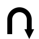

# MultiDimensionalMaze
This is a (up to) six dimensional maze. There are three visual dimensions -  
x (cyan), y (magenta), z (yellow), and three unseen dimensions -  
u (red), v (green), w (blue).  
You start out at the begin cell (1 in each dimension), tan cube inside, and your goal is to reach  
the end cell (max of each dimension), white ball inside.  
To turn left , right , up , down , reverse , or go forward , click on that icon in  
the upper right. The icon will be white if there is a path in that direction,  
otherwise black.  
If there is a pathway in an unseen dimension, there will be a plus and/or  
minus sign in front of you in the color of that dimension. To move in that  
dimension, move to that location, and then click on the + or - sign in the upper right.  
To get a hint, click on the  icon, the hint will appear in the same place inside a circle. Click the icon again to turn off hints.  
The dimensions icon in the upper right  will show the colored orientation, you can click on this icon to change the walls.  
Your current position in the maze is displayed in the lower right.  
You can see the score in the bottom right - the number of moves you have made so far out of the minimum possible moves.  
Also you can see the random number seed in the bottom right. Use this number in the settings page to replay a maze (also duplicate the dimension sizes).  
To change Preferences, click on the Settings button on the main menu.  
On the settings page, you can change the size of each dimension of the maze, drag the slider for that dimension to the new size.  
To collapse a dimension, set the size of that dimension to 1.  
When done, click the **`Apply`** button to set the new maze sizes.  
Click **`Cancel`** to give up any changes.  
- at least two of the dimensions must be not collapsed (not size one).  
- if the total size of the maze is too big, an error message is displayed.  
You can turn the sound on or off, or replay a maze by entering the seed number.  
---  
Maze generator - James Clark - https://github.com/sbj42/maze-generator - backtrack generator  
Sounds - https://freesound.org  
